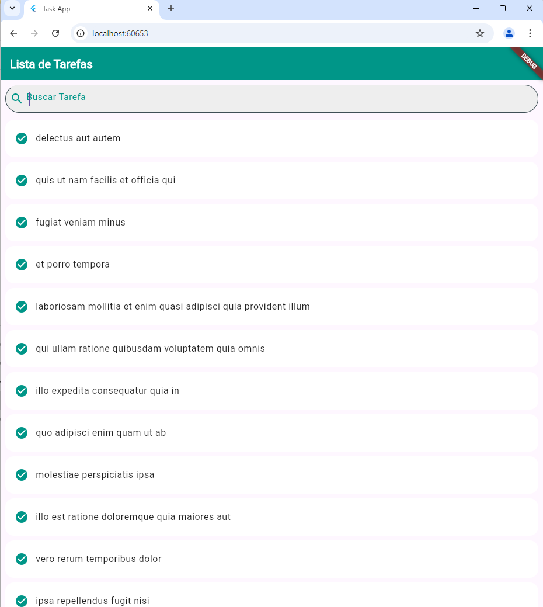

# Task App

Este é um aplicativo simples de tarefas, desenvolvido em Flutter.

## Instruções

1. Clone o repositório: `git clone <url-do-repo>`
2. Navegue até o diretório do projeto: `cd task_app`
3. Instale as dependências: `flutter pub get`
4. Execute o aplicativo: `flutter run`

## Captura de Tela




# List_Task_Flutter

# Descrição

Um aplicativo de tarefas simples criado com Flutter. Este projeto utiliza uma API para carregar uma lista de tarefas e permite buscar tarefas por título.

## Funcionalidades

- Carregamento de tarefas a partir da API `https://jsonplaceholder.typicode.com/todos`.
- Busca filtrada de tarefas com base no título.
- Interface responsiva e estilizada.

## Tecnologias Utilizadas

- Flutter
- Dart
- HTTP (para comunicação com a API)

## Como Rodar o Projeto

1. Clone o repositório:
   ```sh
   git clone https://github.com/SEU_USUARIO/NOME_DO_REPOSITORIO.git
